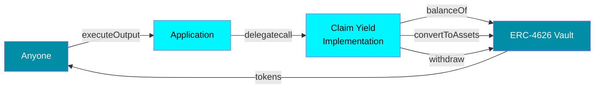

<div align="center">

</div>
<br>
<div align="center">
<i>A Cartesi Rollups Portal for ERC-20 Tokens Re-Hypothecation</i>
</div>
<div align="center">
<b>Using yield‑generating ERC‑4626 vaults while keeping tokens available for use in an application.</b>
</div>
<br>
<p align="center">
	
	
</p>

> [!CAUTION]
> This is an experimental project under development and should be treated as such. **Its use in production/mainnet is not recommended.**


## Table of Contents

- [Overview](#overview)
- [Architecture](#architecture)
- [Getting Started](#getting-started)
  - [Prerequisites](#prerequisites)
  - [Environment](#environment)
  - [Running](#running)
- [Testing](#testing)
- [Development](#development)

## Overview

This project implements a re-hypothecation mechanism for Cartesi Rollups applications. Re-hypothecation allows deposited assets to be put to work in external yield-generating protocols while remaining available for use within the Cartesi application.

The `ERC20ReHypothecationPortal` routes deposited tokens to [ERC-4626](https://eips.ethereum.org/EIPS/eip-4626) vaults, which serve as yield sources. Since major DeFi protocols like [Morpho](https://github.com/morpho-org/vault-v2/blob/main/src/VaultV2.sol) and [Aave](https://aave.com/docs/aave-v3/vaults/overview) implement ERC-4626 compatible vaults, they can be directly integrated as yield sources, enabling applications to earn yield from lending markets and liquidity pools.

## Architecture

### Deposit Flow


### Withdraw Flow


### Claim Yield Flow




## Getting Started

### Running

#### Contracts

The `ERC20ReHypothecationPortal` enables users to deposit ERC-20 tokens that are automatically routed to configured ERC-4626 yield sources (vaults). The vault shares are held by the Cartesi application while user balances are tracked off-chain. This allows idle tokens to generate yield through lending protocols, liquidity pools, or other DeFi strategies while remaining available for use within the Cartesi application.

During deployment, you will be prompted to enter:
- **InputBox address**: The Cartesi InputBox contract address
- **Initial owner address**: The address that will own the portal contract

Deploy contracts:

```sh
# Deploy all contracts
make deploy

# Or deploy individual contracts:
make deploy-erc20-rehypothecation-portal
make deploy-safe-yield-claim
make deploy-mock-application
```

## Testing

The project includes two types of tests:

### Unit Tests

Fast, isolated tests that don't require external dependencies:

```sh
make test-unit
```

### Fork Tests

Integration tests that run against a forked Ethereum mainnet, testing real interactions with DeFi protocols like Morpho.

#### Prerequisites

1. **RPC Access**: You need an Ethereum mainnet RPC endpoint (Alchemy, Infura, or local node)

2. **Environment Setup**:
   ```sh
   # Create .env file from template
   make env

   # Edit .env and configure your RPC URL
   # RPC_URL=https://eth-mainnet.g.alchemy.com/v2/YOUR_API_KEY
   ```

3. **Run Fork Tests**:
   ```sh
   make test-fork
   ```

The fork tests use real mainnet contracts:
- **USDC**: `0xA0b86991c6218b36c1d19D4a2e9Eb0cE3606eB48`
- **Morpho Vault**: `0xBEEF01735c132Ada46AA9aA4c54623cAA92A64CB` (by https://www.steakhouse.financial/)
- **InputBox**: `0xc70074BDD26d8cF983Ca6A5b89b8db52D5850051`

### Run All Tests

Run both unit and fork tests in sequence:

```sh
make test
```

## Development

### Code Quality

1. Format contracts:

   ```sh
   make fmt
   ```

### Utility Commands

1. Check contract sizes:

   ```sh
   make size
   ```

   Shows the size of all compiled contracts to ensure they fit within deployment limits.

2. Run gas reports:

   ```sh
   make gas
   ```

   Generates detailed gas usage reports for all contract functions during testing.

### Available Make Commands

For a complete list of available commands:

```sh
make help
```

This will show all available make targets with their descriptions.
